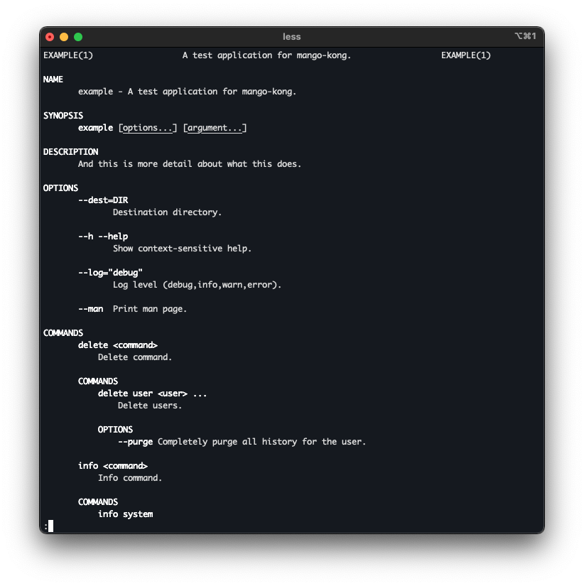

# Mango (man page generator) integration for Kong

This package allows [Kong](https://github.com/alecthomas/kong) packages
to generate man pages using [Mango](https://github.com/muesli/mango).

Simply add `mangokong.ManFlag` to your CLI struct:

```go
var cli struct {
	Man mangokong.ManFlag `help:"Write man page."`
}
```

## Example

This is what the [included example](./example) looks like:


